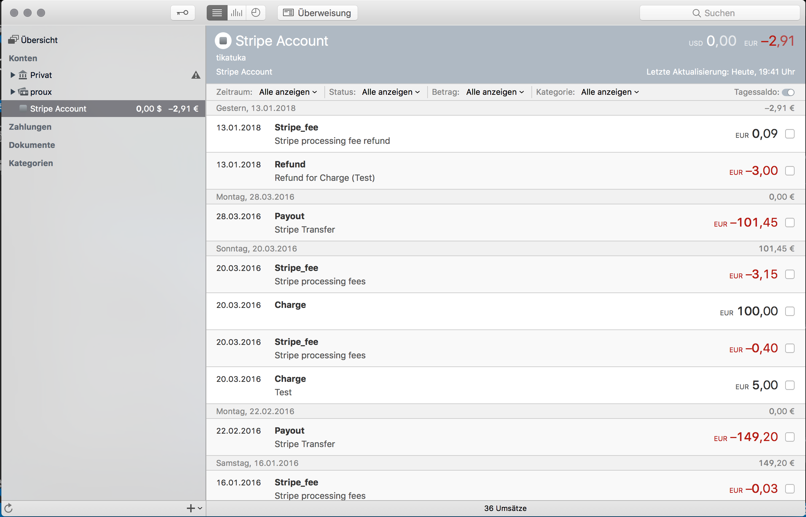

# stripe-moneymoney
Fetches balances from Stripe API and returns them as transactions

## Extension Setup

You can get a signed version of this extension from

* the `dist` directory in this repository

Once downloaded, move `Stripe.lua` to your MoneyMoney Extensions folder.

**Note:** This extension requires MoneyMoney Version 2.3.4 or newer.

## Account Setup

### Stripe

1. Log in to your Stripe account
2. Go to API → API keys
3. Make sure you are using live data
4. Click "Create restricted key"
5. Choose a key name e.g. `moneymoney`
6. Select "Read only" for "Balance"
7. Click "Create key"
8. Click "Reveal live key token"
9. Copy the key starting with `rk_live_`

### MoneyMoney

Add a new account (type "Stripe Account") and use your Stripe Account name as username and your Stripe API key token as password.

## Screenshots

